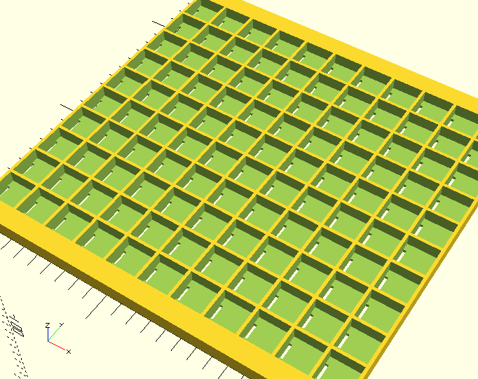
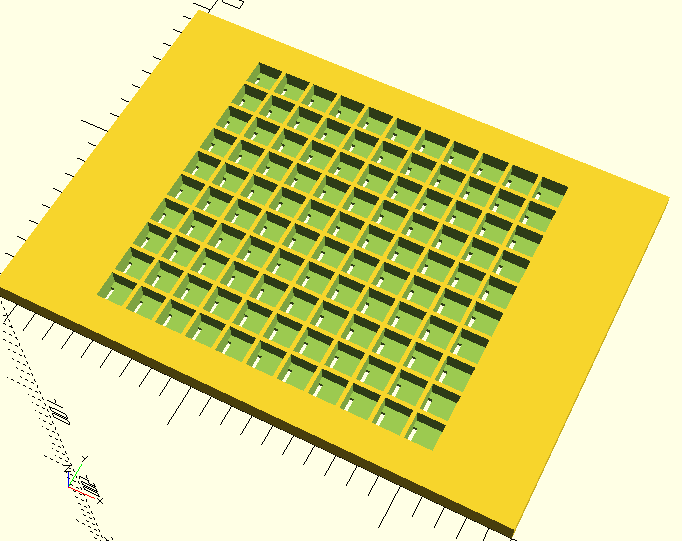
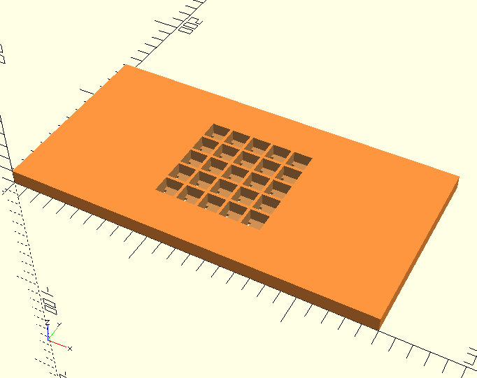
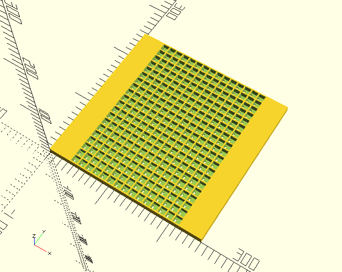
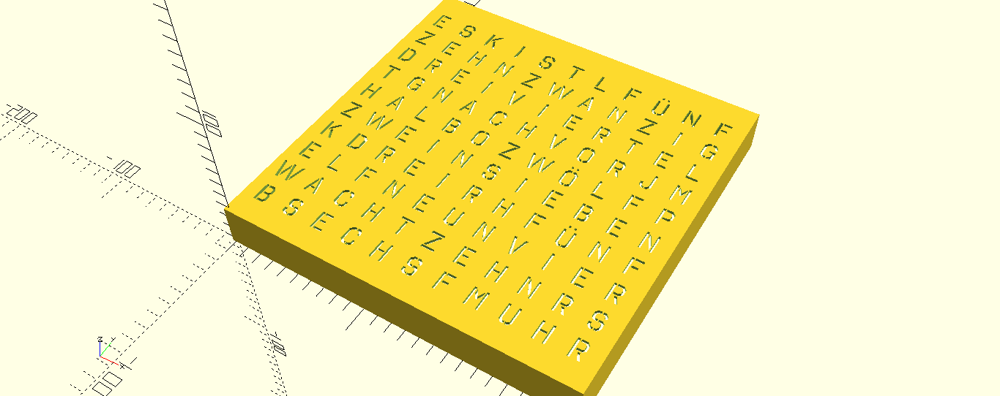
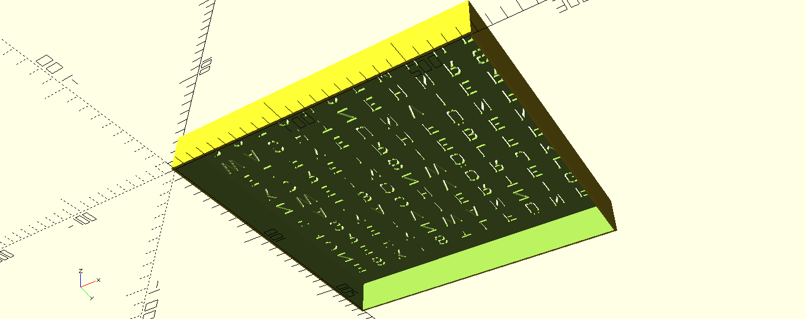
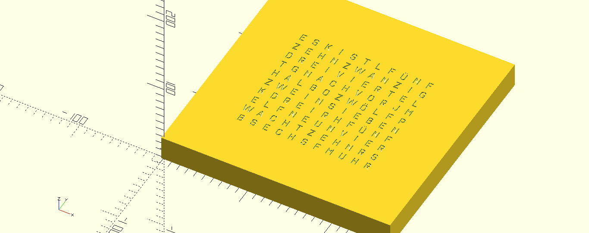

This will be a scalable "WordClock" for 3D printing.
By the way the parts also can be used to create an case with arrays or matrices, etc...

**WORK IN PROGRESS!**
This Model for OpenSCAD is not finished and has not been printed by me.

Info: The font I used is not included right now in this repository!

 

 

 

 

 

 

 
 
 
 
 
 

# LICENSE

<dl>
 Dieses Werk ist lizenziert unter einer <a rel="license" href="http://creativecommons.org/licenses/by/4.0/">Creative Commons Namensnennung 4.0 International Lizenz</a>.
</dl>

<dl>
 This work is licensed under a <a rel="license" href="http://creativecommons.org/licenses/by/4.0/">Creative Commons Attribution 4.0 International License</a>.
</dl>
